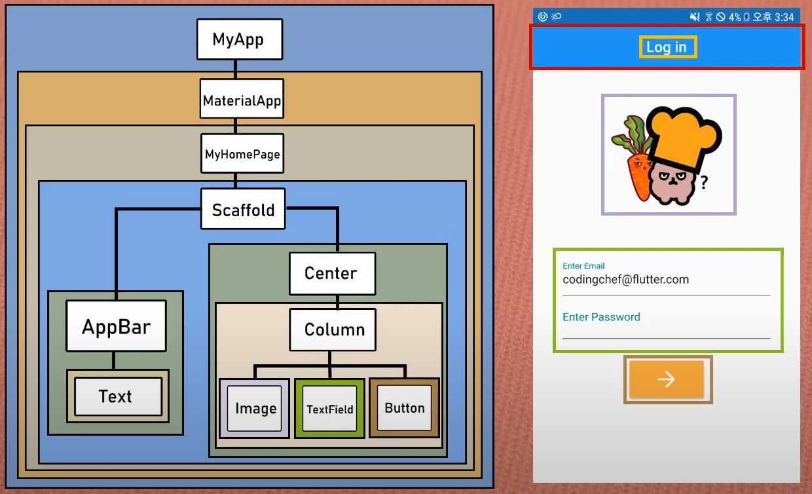

# 완전 초보용 플러터(flutter) 강좌 5 | 플러터에서 제일 중요하다는 위젯이란 무엇일까요?
- https://www.youtube.com/watch?v=jI4kqLdqXic&list=PLQt_pzi-LLfpcRFhWMywTePfZ2aPapvyl&index=5

# `Flutter 상에서의 위젯(widget)이란?`

  1. 독립적으로 실행되는 작은 프로그램
  1. 주로 바탕화면 등에서 날씨나 뉴스, 생활정보 등을 보여줌
  1. 그래픽이나 데이터 요소를 처리하는 함수를 가지고 있음

## What is Widget in flutter?
flutter는 위젯으로 시작해서 위젯으로 끝난다

  1. UI를 만들고 구성하는 모든 기본 단위 요소
  1. 눈에 보이지 않는 요소들까지 위젯
  1. Everything is a widget

## Types of Widgets
flutter에서 중요한 3가지 유형의 위젯

  1. Stateless Widget
  1. Stateful Widget
  1. Inherited Widget

# `Stateless widgets vs. Stateful widgets`

## *Stateless* 와 *Stateful* 의 일반적인 의미

- Stateful : Value값을 지속적으로 추적 보존
- Stateless : 이전 상호작용의 어떠한 값도 저장하지 않음

## Types of Widgets

  1. Stateless Widgets : 상태가 없는 정적인 위젯
  1. Stateful Widgets : 상태를 가지고 계속 움직임이나 변화가 있는 위젯 (동적안 위젯)

## Stateless Widgets

  1. 스크린상에 존재만 할 뿐, 아무 것도 하지 않음
  1. 어떠한 실시간 데이터도 저장하지 않음
  1. 어떤 변화(모양, 상태)를 유발 시키는 value값을 가지지 않음

## Stateful Widgets

  1. 사용자의 interaction에 따라서 모양이 바뀜
  1. 데이터를 받게 되었을 때 모양이 바뀜

# `Widget tree`

  1. Widget들은 tree 구조로 정리될 수 있음
  1. 한 Widget 내에 얼마든지 다른 widget들이 포함될 수 있음
  1. Widget은 부모 위젯과 자식 위젯으로 구성
  1. Parent widget을 widget container라고 부르기도 함

# `Summary`

- Flutter의 모든 것은 Widget
- 위젯이 전혀 변화가 없으면 stateless widgets
- 위젯의 모양이나 상태가 바뀐다면 stateful widgets
- 위젯은 트리구조로 되어 있다.
