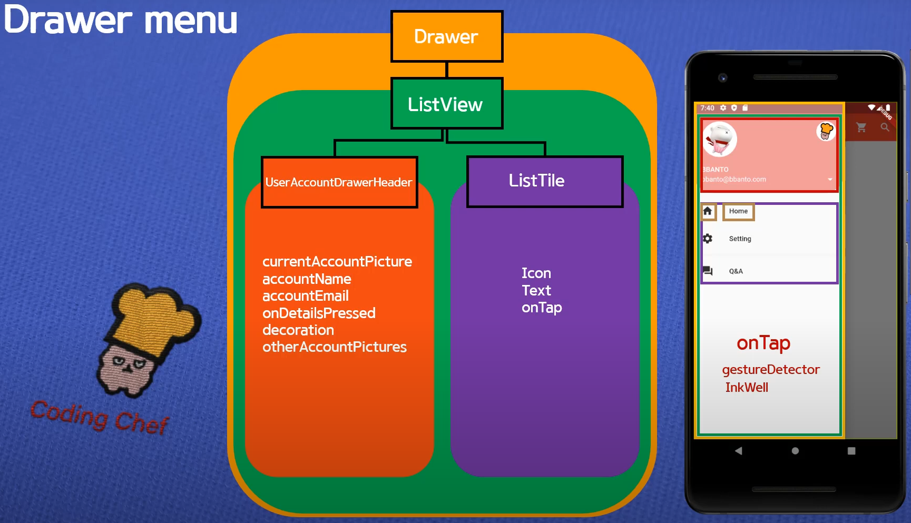

# 완전 초보용 플러터(flutter) 강좌 16 | Drawer 메뉴 만들기 2

- https://www.youtube.com/watch?v=j5O49p7CL1o


## Draw



```Dart
class AppBarPage extends StatelessWidget {
  @override
  Widget build(BuildContext context) {
    return Scaffold(
      appBar: AppBar(
        title: Text('appBar icon menu'),
        centerTitle: true,
        elevation: 0.0,
        actions: <Widget>[
          IconButton(
              icon: Icon(Icons.shopping_cart),
              onPressed: () {
                print('shopping cart button is clicked');
              }),
          IconButton(
              icon: Icon(Icons.search),
              onPressed: () {
                print('search button is clicked');
              })
        ],
      ),
      drawer: Drawer(
        child: ListView(
          padding: EdgeInsets.zero,
          children: <Widget>[
            UserAccountsDrawerHeader(
              currentAccountPicture: CircleAvatar(
                backgroundImage: AssetImage('assets/rabbit-1.png'),
                backgroundColor: Colors.white,
              ),
              otherAccountsPictures: <Widget>[
                CircleAvatar(
                  backgroundImage: AssetImage('assets/rabbit-2.png'),
                  backgroundColor: Colors.white,
                ),
                CircleAvatar(
                  backgroundImage: AssetImage('assets/rabbit-2.png'),
                  backgroundColor: Colors.white,
                )
              ],
              accountName: Text('WHATWANT'),
              accountEmail: Text('whatwant@whatwant.com'),
              onDetailsPressed: () {
                print('arrow is clicked');
              },
              decoration: BoxDecoration(
                  color: Colors.red[200],
                  borderRadius: BorderRadius.only(
                      bottomLeft: Radius.circular(40.0),
                      bottomRight: Radius.circular(40.0))),
            ),
            ListTile(
              leading: Icon(
                Icons.home,
                color: Colors.grey[850],
              ),
              title: Text('Home'),
              onTap: () {
                print('Home is clicked');
              },
              trailing: Icon(Icons.add),
            ),
            ListTile(
              leading: Icon(
                Icons.settings,
                color: Colors.grey[850],
              ),
              title: Text('Setting'),
              onTap: () {
                print('Setting is clicked');
              },
              trailing: Icon(Icons.add),
            ),
            ListTile(
              leading: Icon(
                Icons.question_answer,
                color: Colors.grey[850],
              ),
              title: Text('Q & A'),
              onTap: () {
                print('Q&A is clicked');
              },
              trailing: Icon(Icons.add),
            )
          ],
        ),
      ),
    );
  }
}
```
