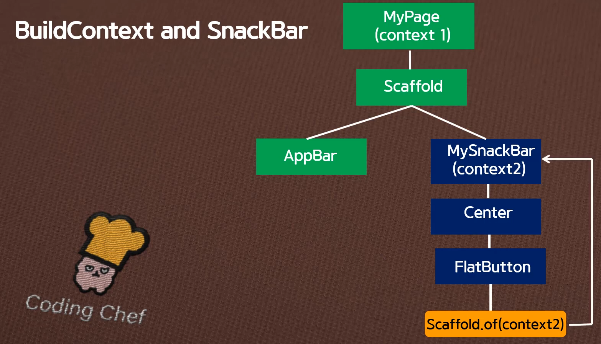

# 완전 초보용 플러터(flutter) 강좌 19 | 빌더(Builder widget)위젯 없이 스낵바(Snack bar)만들기와 토스트 메세지(Toast message) 구현하기
- https://www.youtube.com/watch?v=7E8l9ggxz-Q


## Agenda
1. 빌더 위젯 없이 Snack Bar 만들기
1. Toast message 구현하기


## 빌더 위젯 없이 Snack Bar 만들기
- 18강의에서 context 위치를 찾지 못하는 문제 때문에 Builder를 이용하는 방법을 알아봤다
- 이번에는 Builder 없이 구현하는 방법을 알아보자.
- 기본 개념은 아래와 같다.



```Dart
import 'package:flutter/material.dart';

void main() => runApp(MyApp());

class MyApp extends StatelessWidget {
  @override
  Widget build(BuildContext context) {
    return MaterialApp(
      debugShowCheckedModeBanner: false,
      title: 'Appbar',
      theme: ThemeData(
        primarySwatch: Colors.red,
      ),
      home: Page19(),
    );
  }
}

class Page19 extends StatelessWidget {
  @override
  Widget build(BuildContext context) {
    return Scaffold(
      appBar: AppBar(
        title: Text('Snack Bar'),
        centerTitle: true,
      ),
      body: MySnackBar(),
    );
  }
}

class MySnackBar extends StatelessWidget {
  @override
  Widget build(BuildContext context) {
    return Center(
      child: RaisedButton(
          child: Text('Show me'),
          onPressed: () {
            Scaffold.of(context).showSnackBar(SnackBar(
              content: Text(
                'Hellow',
                textAlign: TextAlign.center,
                style: TextStyle(color: Colors.white),
              ),
              backgroundColor: Colors.teal,
              duration: Duration(milliseconds: 1000),
            ));
          }),
    );
  }
}
```


## Toast message 구현하기

### Toast message를 사용하기 위해서는 사전 등록 작업 필요
- pubspec.yaml 수정

```yaml
dependencies:
  flutter:
    sdk: flutter


  # The following adds the Cupertino Icons font to your application.
  # Use with the CupertinoIcons class for iOS style icons.
  cupertino_icons: ^0.1.3
  fluttertoast: ^3.1.3
```

- import도 해줘야 한다.

```Dart
import 'package:fluttertoast/fluttertoast.dart';
```

### Code

```Dart
import 'package:flutter/material.dart';
import 'package:fluttertoast/fluttertoast.dart';

void main() => runApp(MyApp());

class MyApp extends StatelessWidget {
  @override
  Widget build(BuildContext context) {
    return MaterialApp(
      debugShowCheckedModeBanner: false,
      title: 'Appbar',
      theme: ThemeData(
        primarySwatch: Colors.red,
      ),
      home: Page19and2(),
    );
  }
}

class Page19and2 extends StatelessWidget {
  @override
  Widget build(BuildContext context) {
    return Scaffold(
      appBar: AppBar(
        title: Text('Toast message'),
        centerTitle: true,
      ),
      body: Center(
        child: FlatButton(
          onPressed: () {
            flutterToast();
          },
          child: Text('Toast'),
          color: Colors.blue,
        ),
      ),
    );
  }
}

void flutterToast() {
  Fluttertoast.showToast(
      msg: 'Flutter',
      gravity: ToastGravity.BOTTOM,
      backgroundColor: Colors.redAccent,
      fontSize: 20.0,
      textColor: Colors.white,
      toastLength: Toast.LENGTH_SHORT);
}
```

