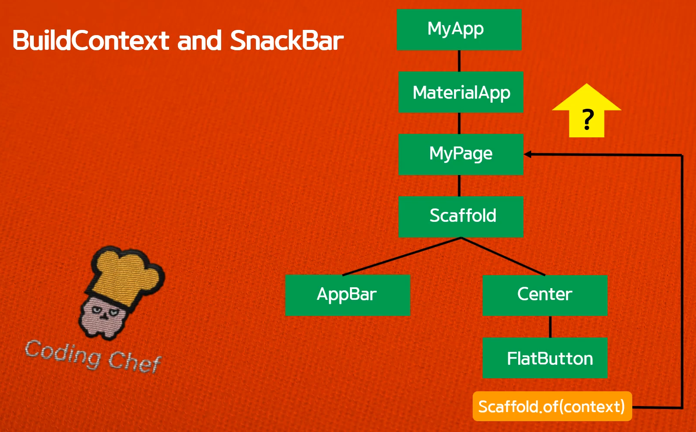
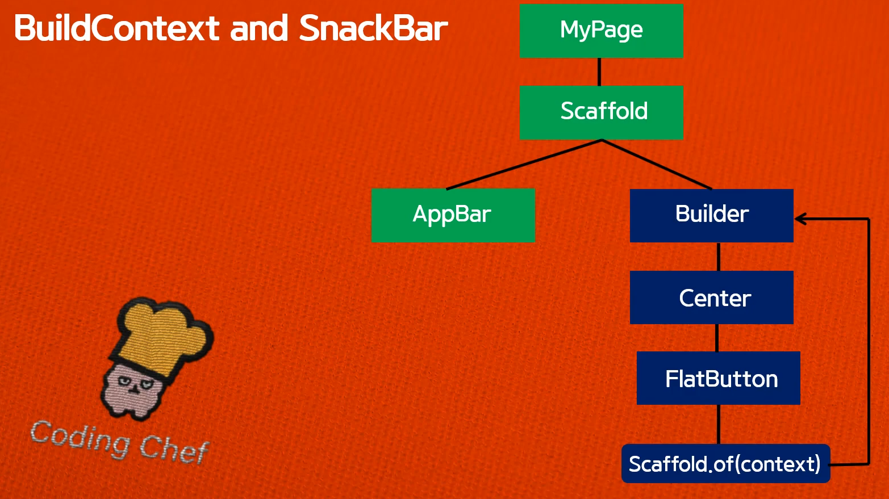

# 완전 초보용 플러터(flutter) 강좌 18 | 스낵바(Snack bar)와 BuildContext
- https://www.youtube.com/watch?v=-zxGPfjiQQA


## Scaffold.of(context) method
- 현재 주어진 context에서 위로 올라가면서 가장 가까운 Scaffold를 찾아서 반환하라
- context vs BuildContext
  - context는 BuildContext의 인스턴스라고 생각하면 된다
- 소스코드에서 `Scaffold.of(context)`라고 할 때, `context`는 `Page18()` (아래 그림에서는 `MyPage`)에서 부터 찾기 때문에 Scaffold를 찾을 수 없게 된다.



```Dart
import 'package:flutter/material.dart';

void main() => runApp(MyApp());

class MyApp extends StatelessWidget {
  @override
  Widget build(BuildContext context) {
    return MaterialApp(
      debugShowCheckedModeBanner: false,
      title: 'Appbar',
      theme: ThemeData(
        primarySwatch: Colors.red,
      ),
      home: Page18(),
    );
  }
}

class Page18 extends StatelessWidget {
  @override
  Widget build(BuildContext context) {
    return Scaffold(
      appBar: AppBar(
        title: Text('Snack Bar'),
        centerTitle: true,
      ),
      body: Center(
        child: FlatButton(
          onPressed: () {
            Scaffold.of(context)
                .showSnackBar(SnackBar(content: Text('Hellow')));
          },
          child: Text(
            'Show me',
            style: TextStyle(color: Colors.white),
          ),
          color: Colors.red,
        ),
      ),
    );
  }
}
```

- 그래서 사용하는 것이 Builder Widget이고, 이를 사용하면 `Builder Widget`을 가리키게 된다.
  - `Scaffold.of(ctx)`와 같이 `context` 부분이 Builder의 `ctx`로 변경된 것을 알 수 있다.



```Dart
class Page18 extends StatelessWidget {
  @override
  Widget build(BuildContext context) {
    return Scaffold(
        appBar: AppBar(
          title: Text('Snack Bar'),
          centerTitle: true,
        ),
        body: Builder(
          builder: (BuildContext ctx) {
            return Center(
              child: FlatButton(
                onPressed: () {
                  Scaffold.of(ctx)
                      .showSnackBar(SnackBar(content: Text('Hellow')));
                },
                child: Text(
                  'Show me',
                  style: TextStyle(color: Colors.white),
                ),
                color: Colors.red,
              ),
            );
          },
        ));
  }
}
```
